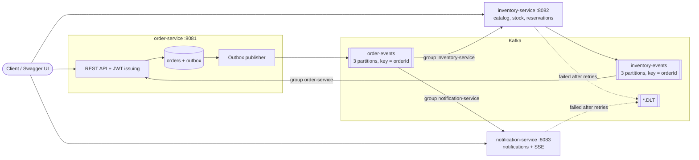

# orderline — event-driven order processing

Backend of a small online shop where **Apache Kafka is the backbone**: every change of an order travels between
services as an event. Built to show production patterns around Kafka — not just "producer + consumer", but delivery
guarantees, idempotency, ordering, failure handling and a distributed transaction via a saga.

**Stack:** Java 21 · Spring Boot 4.1 · Spring Kafka · Apache Kafka 4 (KRaft) · PostgreSQL 16 · Flyway ·
Spring Security (JWT) · MapStruct · springdoc-openapi · Testcontainers · Docker Compose

## Architecture



| Module                 | Responsibility                                                                     |
|------------------------|------------------------------------------------------------------------------------|
| `common`               | Event envelope and types, topics, Retry + DLT error handler, JWT validation, API errors |
| `order-service`        | Users and tokens, orders and their state machine, transactional outbox, saga reactions, payment timeout, Kafka admin endpoints |
| `inventory-service`    | Catalog and stock, reservations, idempotent consumer, saga participant             |
| `notification-service` | Independent consumer of the same `order-events` stream, notification feed, live SSE |

## Order lifecycle (saga)

```
CREATED ──InventoryReserved──▶ RESERVED ──pay──▶ PAID ──ship──▶ SHIPPED ──deliver──▶ DELIVERED
   │                              │
   └──InventoryRejected──▶ CANCELLED ◀──cancel / payment timeout──┘   (stock is returned)
```

| Event               | Topic              | Producer  | Consumers               | Effect                                   |
|---------------------|--------------------|-----------|-------------------------|------------------------------------------|
| `OrderCreated`      | `order-events`     | order     | inventory, notification | inventory tries to reserve all items     |
| `InventoryReserved` | `inventory-events` | inventory | order                   | order → `RESERVED`, waits for payment    |
| `InventoryRejected` | `inventory-events` | inventory | order                   | order → `CANCELLED` (compensation)       |
| `OrderPaid`         | `order-events`     | order     | inventory, notification | reservation confirmed                    |
| `OrderCancelled`    | `order-events`     | order     | inventory, notification | reserved stock is released               |
| `OrderShipped` / `OrderDelivered` | `order-events` | order | notification       | customer is notified                     |

Every event is a JSON envelope: `eventId`, `type`, `version`, `occurredAt`, `orderId`, `payload`.
The Kafka message key is `orderId`.

## What the project demonstrates

- **Ordering by key.** All events of one order land in the same partition and are processed in order;
  different orders are processed in parallel (3 partitions, listener concurrency 3).
- **Fan-out with consumer groups.** Inventory and Notification read the same topic independently.
  Adding a third consumer requires no changes in the first two.
- **Delivery guarantees.** Producer with `acks=all` and idempotence; consumers commit offsets only after
  the record is processed (`ack-mode: record`, auto commit off) — at-least-once delivery.
- **Idempotent consumer.** `INSERT ... ON CONFLICT DO NOTHING` into `processed_events` runs in the same DB
  transaction as the business change, so a redelivered event changes nothing.
- **Transactional outbox.** The order change and its event are written in one DB transaction; a scheduled
  publisher sends pending rows to Kafka. No "saved to DB but event lost" window.
- **Saga with compensation.** Out of stock → `InventoryRejected` → order cancelled; cancellation or payment
  timeout → `OrderCancelled` → stock returned.
- **Retry + Dead Letter Topic.** 3 retries with exponential backoff, then the record goes to `<topic>.DLT`.
  Invalid events (bad JSON, missing fields) skip retries — retrying a poison pill cannot fix it.
- **Concurrency.** Pessimistic row locks on products taken in a fixed order (no deadlocks between orders),
  optimistic locking (`@Version`) on orders.

## Quick start

Requirements: Docker Desktop.

```bash
docker compose up -d --build
```

| What                 | URL                                   |
|----------------------|---------------------------------------|
| Order Service API    | http://localhost:8081/swagger-ui.html |
| Inventory Service API| http://localhost:8082/swagger-ui.html |
| Notification API     | http://localhost:8083/swagger-ui.html |
| Kafka UI (optional)  | http://localhost:8090                 |

Kafka UI is not started by default to save memory. Add it with `docker compose --profile tools up -d`.
Every container has a memory limit (about 2.8 GB for the whole stack); services size their heap
from it with `-XX:MaxRAMPercentage=75`.

An administrator account is created on startup: `admin@orderline.local` / `administrator`
(override with `ADMINISTRATOR_EMAIL` / `ADMINISTRATOR_PASSWORD`, see `.env.example`).

Run only the infrastructure and start services from the IDE:

```bash
docker compose up -d postgres kafka
```

Tests (need Docker for Testcontainers):

```bash
./mvnw verify
```

## Walkthrough

```bash
# 1. Get a token (guest login creates a throwaway user)
TOKEN=$(curl -s -X POST localhost:8081/authentication/guest | jq -r .accessToken)

# 2. Browse the catalog (public)
curl -s localhost:8082/products | jq '.content[] | {id, name, stock}'

# 3. Place an order — the saga starts
ORDER=$(curl -s -X POST localhost:8081/orders -H "Authorization: Bearer $TOKEN" \
  -H 'Content-Type: application/json' \
  -d '{"items":[{"productId":"11111111-1111-1111-1111-111111111111","quantity":2}]}' | jq -r .id)

# 4. A moment later the order is RESERVED, stock is reduced
curl -s localhost:8081/orders/$ORDER/timeline -H "Authorization: Bearer $TOKEN"

# 5. Pay, then read notifications (or keep a live stream open: GET /notifications/stream)
curl -s -X POST localhost:8081/orders/$ORDER/pay -H "Authorization: Bearer $TOKEN"
curl -s localhost:8083/notifications -H "Authorization: Bearer $TOKEN"
```

Product `55555555-5555-5555-5555-555555555555` has zero stock — ordering it shows the compensation path.

### Demonstration endpoints (ADMIN)

| Endpoint                                                         | What it shows                                   |
|------------------------------------------------------------------|-------------------------------------------------|
| `POST /administration/demonstration/duplicate-event?orderId=...` | Re-sends the last event of an order with the same `eventId` — nothing changes twice |
| `POST /administration/demonstration/simulate-failure`            | Sends an invalid event — both consumers route it to `order-events.DLT` |
| `GET  /administration/dead-letters`                              | Lists records in the DLTs with the failure reason |
| `POST /administration/dead-letters/{topic}/{partition}/{offset}/retry` | Republishes a dead letter to its original topic |
| `GET  /administration/kafka/overview`                            | End offsets per partition, consumer lag per group, recent outbox events |

## API

| Method | Path                                   | Service      | Access |
|--------|----------------------------------------|--------------|--------|
| POST   | `/authentication/registration`         | order        | public |
| POST   | `/authentication/login`                | order        | public |
| POST   | `/authentication/guest`                | order        | public |
| GET    | `/users/me`                            | order        | user   |
| POST   | `/orders`                              | order        | user   |
| GET    | `/orders` (`?status=`, paging)         | order        | user   |
| GET    | `/orders/{id}`                         | order        | owner / admin |
| GET    | `/orders/{id}/timeline`                | order        | owner / admin |
| POST   | `/orders/{id}/pay`                     | order        | owner / admin |
| POST   | `/orders/{id}/cancel`                  | order        | owner / admin |
| POST   | `/orders/{id}/ship`                    | order        | admin  |
| POST   | `/orders/{id}/deliver`                 | order        | admin  |
| GET    | `/products`, `/products/{id}`          | inventory    | public |
| POST   | `/administration/products`             | inventory    | admin  |
| PUT    | `/administration/products/{id}/stock`  | inventory    | admin  |
| GET    | `/notifications`                       | notification | user   |
| PATCH  | `/notifications/{id}/read`             | notification | owner  |
| GET    | `/notifications/stream` (SSE)          | notification | user   |
| GET    | `/actuator/health`                     | all          | public |

Errors are returned as RFC 9457 Problem Details.

## Known limitations and what production would do

| Limitation | Production approach |
|------------|---------------------|
| Outbox publisher polls the table and keeps a DB transaction open while sending; two instances would publish the same rows | `SELECT ... FOR UPDATE SKIP LOCKED` or a single leader; at scale — CDC with Debezium |
| Inventory sends its event inside the DB transaction: if the commit fails after a successful send, the event is a phantom (consumers stay correct thanks to state checks and idempotency) | An outbox in Inventory as well |
| `processed_events` grows forever | Periodic cleanup of rows older than the topic retention |
| Tokens are issued by Order Service and signed with a shared HS256 secret — any service holding it could mint tokens; no refresh tokens or revocation | A dedicated identity provider (Keycloak, Auth0) with RS256 + JWKS; refresh token rotation lives there |
| No rate limiting on login and guest endpoints | API gateway / rate limiter |
| JSON events without a schema registry; `version` field is the only evolution mechanism | Avro or Protobuf with Schema Registry and compatibility checks |
| One PostgreSQL instance with three databases, one Kafka broker | Separate DB per service, a 3-broker cluster with `min.insync.replicas=2` |
| SSE subscriptions live in memory of one instance | Shared pub/sub (Redis) or sticky sessions |
| Payment is a stub | Payment service as another saga participant |
